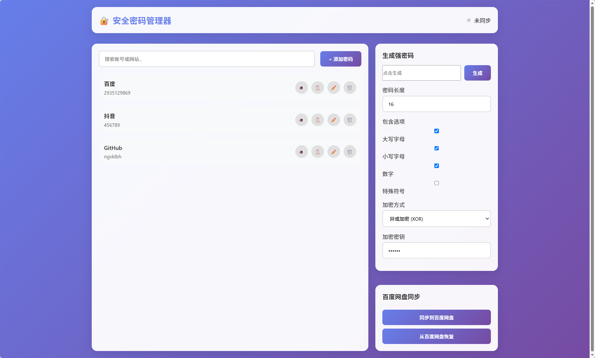

[README.md](https://github.com/user-attachments/files/28660233/README.md)

# KeyVault
本项目基于原生HTML、CSS、JS开发离线密码管理器，开发旨在夯实前端编程与基础加密算法能力；面向注重隐私、不愿使用联网密码软件的普通用户，实现密码加密存储、生成与本地备份。

## Authors

- [@Ricardo-M-Chen1](https://www.github.com/Ricardo-M-Chen1)

## 技术

HTML+css+Javascript

## 功能清单
    1. 自定义规则高强度随机密码生成
    2. XOR算法加密存储账号信息，无明文落地
    3. 密码记录新增、查询、管理
    

## Optimizations

- 深色/浅色主题切换
- 密码分类管理
- 后续数据库、后端的搭建

## Screenshots

## Acknowledgements

 - [idea的来源]：葛同学
 
 - [代码书写]：老己

